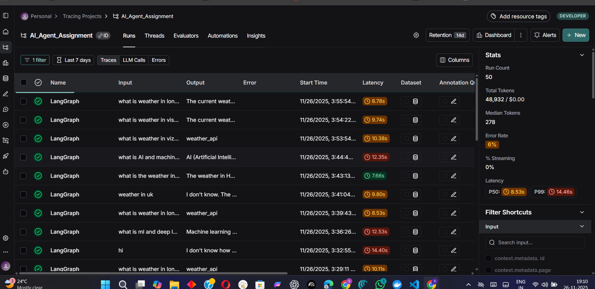
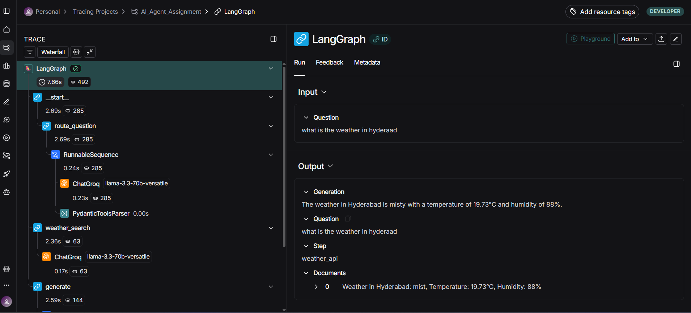
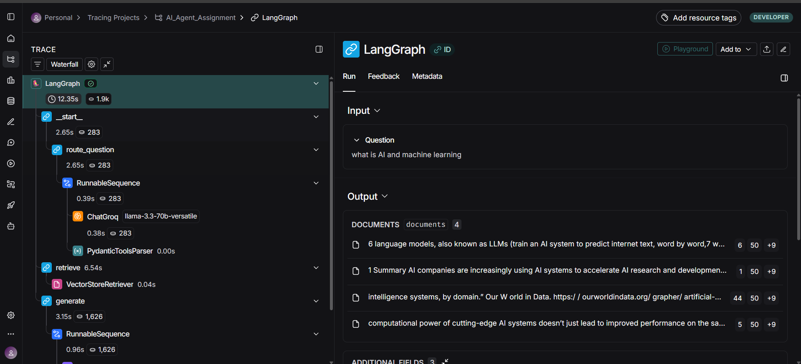

# ⚡ Nexus Agent: Intelligent Agentic RAG & Weather Pipeline


-red)


**Nexus Agent** is an advanced AI assistant capable of intelligently routing user queries between **real-time weather data** and **document-based knowledge** (RAG).

Built with a focus on **observability and user experience**, it features real-time token streaming, a transparent thought process display, and a modern "App-like" dark mode interface.

---

## 📋 Table of Contents
- [✨ Key Features](#-key-features)
- [🏗️ System Architecture](#-system-architecture)
- [⚙️ Tech Stack](#-tech-stack)
- [🚀 Installation & Setup](#-installation--setup)
- [💻 Usage Guide](#-usage-guide)
- [🧪 Testing](#-testing)
- [📊 Evaluation (LangSmith)](#-evaluation-langsmith)
- [📂 Project Structure](#-project-structure)

---

## ✨ Key Features

### 🧠 Intelligent Core
* **Smart Routing:** A **LangGraph** router (powered by **Groq**) dynamically decides whether to call the `Weather Tool` or the `RAG Retriever` based on user intent.
* **Agentic Workflow:** Uses a state-based graph to manage conversation history and tool execution steps.

### 🎨 Modern User Experience (UI/UX)
* **⚡ Real-Time Streaming:** Responses flow token-by-token (Typewriter effect), just like ChatGPT/Gemini.
* **💭 Transparent Thought Process:** Every agent response includes a collapsible **"Thought Process"** section, allowing users to inspect the exact steps taken (e.g., "Router decided X", "Tool returned Y").
* **📱 App-Like Interface:** Custom CSS implementation for:
    * **Sticky Header:** Persistent navigation bar.
    * **Message Alignment:** User (Right/Transparent) vs. Agent (Left/Transparent).
    * **Clean Layout:** Fixed chat input at the bottom for a seamless feel.

### 📚 Retrieval-Augmented Generation (RAG)
* **Local Vector Store:** Ingests PDF, TXT, and DOCX files into a local **Qdrant** instance.
* **HuggingFace Embeddings:** Uses `sentence-transformers/all-MiniLM-L6-v2` for high-quality retrieval.

### 👀 Observability
* **Live Internals Tab:** A split-screen view showing the **Active Tool** on the left and the **Raw Data Payload** (JSON/Text) on the right.
* **LangSmith Integration:** Full tracing of latency, token usage, and decision paths.

---

## 🏗️ System Architecture

The agent operates on a directed graph workflow:

1.  **Start Node:** Receives user query.
2.  **Router Node:** LLM classifies intent $\rightarrow$ `Weather` OR `Document`.
3.  **Tool Nodes:**
    **Weather Path:** Calls OpenWeatherMap API.
    **RAG Path:** Queries Qdrant Vector DB for relevant chunks.
4.  **Generator Node:** LLM synthesizes the tool output into a natural language response.
5.  **Streaming Output:** The final answer is streamed to the UI while steps are logged.

---

## ⚙️ Tech Stack

* **LLM:** Groq (`llama-3.3-70b-versatile`)
* **Orchestration:** LangChain & LangGraph
* **Vector Database:** Qdrant (Embedded/Local mode)
* **Embeddings:** HuggingFace (`sentence-transformers/all-MiniLM-L6-v2`)
* **UI Framework:** Streamlit (with Custom CSS)
* **Testing:** Pytest
* **Evaluation:** LangSmith

---

## 🚀 Installation & Setup

### Prerequisites
* Python 3.9+
* Git

### Steps

1.  **Clone the Repository**
    ```bash
    git clone [https://github.com/yathik-2622/Nexus-RAG-Agent.git](https://github.com/yathik-2622/Nexus-RAG-Agent.git)
    cd Nexus-RAG-Agent
    ```

2.  **Create a Virtual Environment**
    ```bash
    python -m venv .venv
    source .venv/bin/activate  # On Windows: .venv\Scripts\activate
    ```

3.  **Install Dependencies**
    ```bash
    pip install -r requirements.txt
    ```

4.  **Configuration**
    Create a `.env` file in the root directory:
    ```ini
    GROQ_API_KEY="gsk_..."
    OPENWEATHERMWAP_API_KEY="..."
    
    # LangSmith (Optional but recommended)
    LANGCHAIN_TRACING_V2=true
    LANGCHAIN_API_KEY="lsv2_..."
    ```

---

## 💻 Usage Guide

### 1. Launch the App
```bash
streamlit run app.py
```


# 2. Interaction Modes
🌤️ Weather Mode
Ask: "What is the current temperature in New York?"

# Observe:
* The chat will show a "🧠 Processing Query..." status box.
* Once complete, the answer streams in.
* Check the "Internals" tab to see the raw JSON response from OpenWeatherMap.

# 📚 RAG (Document) Mode
* Open the Sidebar.
* Upload a PDF or TXT file.
* Click "⚡ Embed & Ingest".
* Ask: "Summarize the document" or "What are the key findings?"
* Inspect: Click the "View Thought Process" expander under the answer to see that the agent chose the "Retrieval" path.

# 🧪 Testing
Run the automated test suite to verify API connectivity and router logic:

```bash
pytest tests/test_logic.py -v
(or)
pytest -m tests/test_logic.py -v
```
# Coverage:
* test_weather_api: Validates real connectivity to OpenWeatherMap.
* test_router: Ensures the LLM correctly classifies intents.
* test_ingest: Verifies Qdrant ingestion pipeline.
### ✅ Test Results


## 📊 Evaluation (LangSmith)

This project is fully integrated with **LangSmith** for evaluation.
* **Traces:** Every interaction is logged to monitor latency and token usage.
* **Decision Making:** The screenshot below shows the agent correctly routing queries.






# 📂 Repository Structure :
```bash
Nexus-RAG-Agent/
├── data/                   # Local Qdrant storage (gitignored)
├── src/
│   ├── components/
│   │   ├── ingestion.py    # Qdrant & Embedding logic
│   │   ├── router.py       # Classification Logic
│   │   ├── tools.py        # Weather API Tool
│   │   └── graph.py        # LangGraph State Machine
│   ├── utils/
│   │   └── logger.py       # Custom UI Logging
├── tests/                  # Unit Tests
├── app.py                  # Main Streamlit UI
├── requirements.txt        # Dependencies
└── .env                    # Secrets

# for theme Use .streamlit/ folder
```

### 🎥 Project Walkthrough


